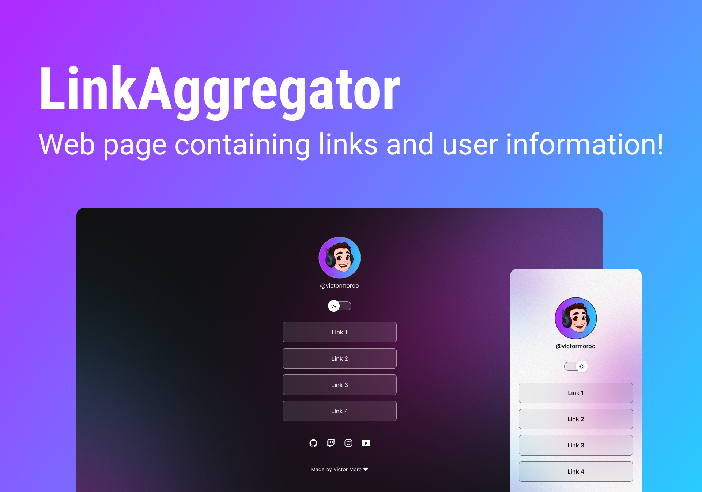

<h1 align="center"> LinkAggregator </h1>

Exclusive and free program, promoted by Rocketseat for teaching WEB technologies.  

  <a href="#-Technologies">Technologies</a>&nbsp;&nbsp;&nbsp;|&nbsp;&nbsp;&nbsp;
  <a href="#-project">Project</a>&nbsp;&nbsp;&nbsp;|&nbsp;&nbsp;&nbsp;
  <a href="#-layout">Layout</a>&nbsp;&nbsp;&nbsp;|&nbsp;&nbsp;&nbsp;
  <a href="#memo-license">License</a>

  

 

  

## 🚀 Technologies

This project was developed with the following technologies:

- HTML e CSS
- JavaScript
- Git e Github
- Figma

## 💻 Project

LinkAggregator is a web site created to combine links and use as an online business card.

- [Access the finished project](https://victormoroo.github.io/Link_Aggregator/)

## 🔖 Layout

You can preview the project layout through [DESSE LINK](https://www.figma.com/community/file/1187422022288947321). It is necessary to have an account on [Figma](https://figma.com) to access it.

## :memo: License

This project is licensed under the MIT.

---

Made with ♥ by Victor Moro:
- [Linkedin](https://www.linkedin.com/in/victormoroo/)
- [GitHub](https://github.com/Victormoroo)
